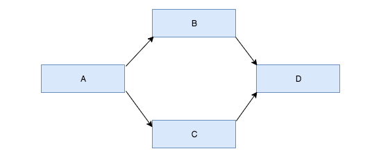
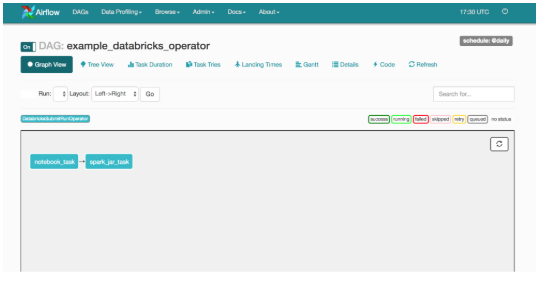
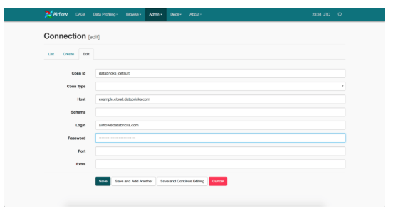

# Ingerate Apache Airflow with Databricks

from https://databricks.com/blog/2017/07/19/integrating-apache-airflow-with-databricks.html

---
This article explains how you can set up Airflow and use it to trigger Databricks jobs.

One very popular feature of Databricks’ Unified Analytics Platform (UAP) is the ability to convert a data science notebook directly into production jobs that can be run regularly. While this feature unifies the workflow from exploratory data science to production data engineering, some data engineering jobs can contain complex dependencies that are difficult to capture in notebooks. To support these complex use cases, we provide REST APIs so jobs based on notebooks and libraries can be triggered by external systems. Of these, one of the most common schedulers used by our customers is Airflow. We are happy to share that we have also extended Airflow to support Databricks out of the box.

## Airflow Basics  
Airflow is a generic workflow scheduler with dependency management. Besides its ability to schedule periodic jobs, Airflow lets you express explicit dependencies between different stages in your data pipeline.

Each ETL pipeline is represented as a directed acyclic graph (DAG) of tasks (not to be mistaken with Spark’s own DAG scheduler and tasks). Dependencies are encoded into the DAG by its edges — for any given edge, the downstream task is only scheduled if the upstream task completed successfully. For example, in the example, DAG below, task B and C will only be triggered after task A completes successfully. Task D will then be triggered when task B and C both complete successfully.

The tasks in Airflow are instances of “operator” class and are implemented as small Python scripts. Since they are simply Python scripts, operators in Airflow can perform many tasks: they can poll for some precondition to be true (also called a sensor) before succeeding, perform ETL directly, or trigger external systems like Databricks.

For more information on Airflow, please take a look at their documentation.

Native Databricks Integration in Airflow
We implemented an Airflow operator called DatabricksSubmitRunOperator, enabling a smoother integration between Airflow and Databricks. Through this operator, we can hit the Databricks Runs Submit API endpoint, which can externally trigger a single run of a jar, python script, or notebook. After making the initial request to submit the run, the operator will continue to poll for the result of the run. When it completes successfully, the operator will return allowing for downstream tasks to run.

We’ve contributed the DatabricksSubmitRunOperator upstream to the open-source Airflow project. However, the integrations will not be cut into a release branch until Airflow 1.9.0 is released. Until then, to use this operator you can install Databricks’ fork of Airflow, which is essentially Airflow version 1.8.1 with our DatabricksSubmitRunOperator patch applied.

pip install --upgrade "git+git://github.com/databricks/incubator-airflow.git@1.8.1-db1#egg=apache-airflow[databricks]"
Airflow with Databricks Tutorial
In this tutorial, we’ll set up a toy Airflow 1.8.1 deployment which runs on your local machine and also deploy an example DAG which triggers runs in Databricks.

The first thing we will do is initialize the sqlite database. Airflow will use it to track miscellaneous metadata. In a production Airflow deployment, you’ll want to edit the configuration to point Airflow to a MySQL or Postgres database but for our toy example, we’ll simply use the default sqlite database. To perform the initialization run:

airflow initdb
The SQLite database and default configuration for your Airflow deployment will be initialized in ~/airflow.

In the next step, we’ll write a DAG that runs two Databricks jobs with one linear dependency. The first Databricks job will trigger a notebook located at /Users/airflow@example.com/PrepareData, and the second will run a jar located at dbfs:/lib/etl-0.1.jar. To save time, we’ve already gone ahead and written the DAG for you here.

From a mile high view, the script DAG essentially constructs two DatabricksSubmitRunOperator tasks and then sets the dependency at the end with the set_dowstream method. A skeleton version of the code looks something like this:

notebook_task = DatabricksSubmitRunOperator(
    task_id='notebook_task',
    …)

spark_jar_task = DatabricksSubmitRunOperator(
    task_id='spark_jar_task',
    …)
notebook_task.set_downstream(spark_jar_task)
In reality, there are some other details we need to fill in to get a working DAG file. The first step is to set some default arguments which will be applied to each task in our DAG.

args = {
    'owner': 'airflow',
    'email': ['airflow@example.com'],
    'depends_on_past': False,
    'start_date': airflow.utils.dates.days_ago(2)
}
The two interesting arguments here are depends_on_past and start_date. If depends_on_past is true, it signals Airflow that a task should not be triggered unless the previous instance of a task completed successfully. The start_date argument determines when the first task instance will be scheduled.

The next section of our DAG script actually instantiates the DAG.

dag = DAG(
    dag_id='example_databricks_operator', default_args=args,
    schedule_interval='@daily')
In this DAG, we give it a unique ID, attach the default arguments we declared earlier, and give it a daily schedule. Next, we’ll specify the specifications of the cluster that will run our tasks.

        new_cluster = {
            'spark_version': '2.1.0-db3-scala2.11',
            'node_type_id': 'r3.xlarge',
            'aws_attributes': {
                'availability': 'ON_DEMAND'
            },
            'num_workers': 8
        }
The schema of this specification matches the new cluster field of the Runs Submit endpoint. For your example DAG, you may want to decrease the number of workers or change the instance size to something smaller.

Finally, we’ll instantiate the DatabricksSubmitRunOperator and register it with our DAG.

        notebook_task_params = {
            'new_cluster': new_cluster,
            'notebook_task': {
                'notebook_path': '/Users/airflow@example.com/PrepareData',
            },
        }
        # Example of using the JSON parameter to initialize the operator.
        notebook_task = DatabricksSubmitRunOperator(
            task_id='notebook_task',
            dag=dag,
            json=notebook_task_params)  
            
In this piece of code, the JSON parameter takes a python dictionary that matches the Runs Submit endpoint.

To add another task downstream of this one, we do instantiate the DatabricksSubmitRunOperator again and use the special set_downstream method on the notebook_task operator instance to register the dependency.

        # Example of using the named parameters of DatabricksSubmitRunOperator
        # to initialize the operator.
        spark_jar_task = DatabricksSubmitRunOperator(
            task_id='spark_jar_task',
            dag=dag,
            new_cluster=new_cluster,
            spark_jar_task={
                'main_class_name': 'com.example.ProcessData'
            },
            libraries=[
                {
                    'jar': 'dbfs:/lib/etl-0.1.jar'
                }
            ]
        )

notebook_task.set_downstream(spark_jar_task)
This task runs a jar located at dbfs:/lib/etl-0.1.jar.

Notice that in the notebook_task, we used the JSON parameter to specify the full specification for the submit run endpoint and that in the spark_jar_task, we flattened the top level keys of the submit run endpoint into parameters for the DatabricksSubmitRunOperator. Although both ways of instantiating the operator are equivalent, the latter method does not allow you to use any new top level fields like spark_python_task or spark_submit_task. For more detailed information about the full API of DatabricksSubmitRunOperator, please look at the documentation here.

Now that we have our DAG, to install it in Airflow create a directory in ~/airflow called ~/airflow/dags and copy the DAG into that directory.

At this point, Airflow should be able to pick up the DAG.

        $ airflow list_dags                                                           [10:27:13]
        [2017-07-06 10:27:23,868] {__init__.py:57} INFO - Using executor SequentialExecutor
        [2017-07-06 10:27:24,238] {models.py:168} INFO - Filling up the DagBag from /Users/andrew/airflow/dags

        -------------------------------------------------------------------
        DAGS
        -------------------------------------------------------------------
        example_bash_operator
        example_branch_dop_operator_v3
        example_branch_operator
        example_databricks_operator  

We can also visualize the DAG in the web UI. To start it up, run airflow webserver and connect to localhost:8080. Clicking into the “example_databricks_operator,” you’ll see many visualizations of your DAG. Here is the example:

At this point, a careful observer might also notice that we don’t specify information such as the hostname, username, and password to a Databricks shard anywhere in our DAG. To configure this we use the connection primitive of Airflow that allows us to reference credentials stored in a database from our DAG. By default, all DatabricksSubmitRunOperator set the databricks_conn_id parameter to “databricks_default,” so for our DAG, we’ll have to add a connection with the ID “databricks_default.”

The easiest way to do this is through the web UI. Clicking into the “Admin” on the top and then “Connections” in the dropdown will show you all your current connections. For our use case, we’ll add a connection for “databricks_default.” The final connection should look something like this:

Now that we have everything set up for our DAG, it’s time to test each task. To do this for the notebook_task we would run, airflow test example_databricks_operator notebook_task 2017-07-01 and for the spark_jar_task we would run airflow test example_databricks_operator spark_jar_task 2017-07-01. To run the DAG on a schedule, you would invoke the scheduler daemon process with the command airflow scheduler.

If everything goes well, after starting the scheduler, you should be able to see backfilled runs of your DAG start to run in the web UI.

### Next Steps
In conclusion, this blog post provides an easy example of setting up Airflow integration with Databricks. It demonstrates how Databricks extension to and integration with Airflow allows access via Databricks Runs Submit API to invoke computation on the Databricks platform. For more detailed instructions on how to set up a production Airflow deployment, please look at the official Airflow documentation.