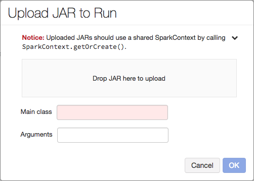
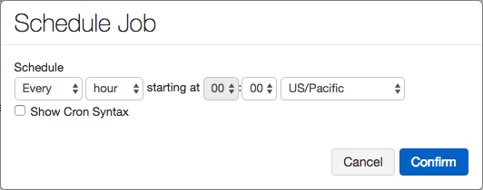
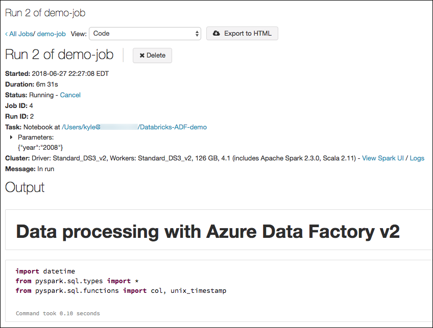
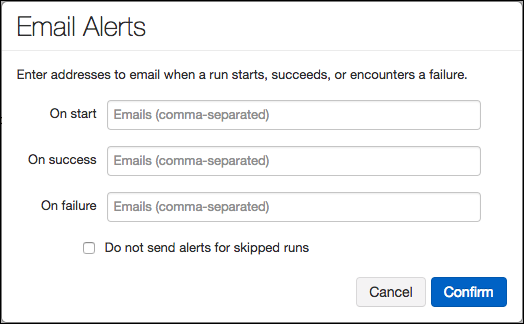
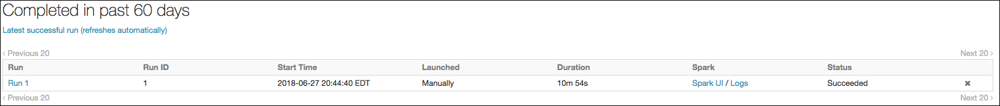
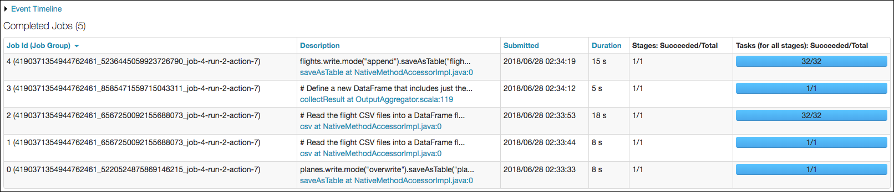
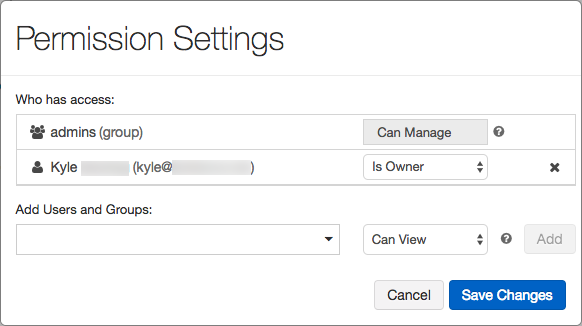

# Jobs

[Azure Databricks Jobs](https://docs.azuredatabricks.net/user-guide/jobs.html) provide a mechanism for automating the execution of a notebook or JAR, either immediately or on a scheduled basis. Jobs can be created, run, and monitored using the Databricks UI, the CLI, and by invoking the Jobs API.

## Creating jobs

Creation of jobs is accomplished by selecting **Jobs** from the left-hand menu in your Azure Databricks workspace, and then selecting **Create**.

Note that the number of jobs is limited to 1000. A point to consider around this limit is that notebook execution can be chained using the `%run` command or Notebook Workflows (see [Notebooks](../notebooks/notebooks-overview.md) for more details), which can allow jobs to be created that run multiple notebooks in a single job, while keeping the number of jobs lower.

### Task selection

The first choice to make when creating a job is the task that it will run. This can be either to run a notebook or JAR. The **Configure spark-submit** option listed to the right of these allows you to enter optional spark-submit parameters. Click **Configure spark-submit** to open the Set Parameters dialog, and you can enter spark-submit parameters as a JSON array.

#### Notebook

Running a notebook via a job is a straight-forward task. You simply click **Select notebook** next to **Task**, and select the notebook from your workspace that you would like the job to run. At this point, you can run the job with no further configuration, if desired, or you can set other task-specific options associated with a notebook task.

Once you select running a notebook as the **Task** for your job, you are presented with two additional task-specific options:

1. Run a notebook job with different parameters

    - Parameters allow a single notebook job to produce different output, based on user provided values. This is very useful if jobs are run by business users with different needs. For example, one business user may want to perform analysis on data only from the year 2018, while another may be interested in looking at all data available.
    - Parameters can also be overridden by selecting **Run Now With Different Parameters**.

2. Add dependent libraries

    - Third-party or locally-built libraries can be added as dependencies to your notebook with this option. These will be automatically attached to your cluster on launch. To learn more about libraries read the [Third-party and local libraries](../libraries/third-party-and-local-libraries.md) article.

The other shared options, such as scheduling and alerts are discussed in detail below.

#### JAR

Running a JAR with a job requires some knowledge about the JAR, including its `main` function and any arguments it expects. To do this, select **Set JAR** on the job page. On the **Upload JAR to Run** dialog, you will drag and drop the JAR into the Drop area, then specify the Main class of the JAR. Arguments are optional.



> JAR jobs are parameterized with an array of strings. In the UI, you input the parameters in the **Arguments** text box which are split into an array by applying POSIX shell parsing rules. For more information, reference the [shlex documentation](https://docs.python.org/2/library/shlex.html#shlex.split). In the API, you input the parameters as a standard JSON array. For more information, reference [SparkJarTask](https://docs.azuredatabricks.net/api/latest/jobs.html#jobssparkjartask). To access these parameters, inspect the String array passed into your `main` function.

There are a few caveats you need to be aware of when you run a JAR job:

- **Use the shared SparkContext** within JAR job programs. Because Databricks initializes the SparkContext, programs that invoke new SparkContext() will fail. Databricks will create a Spark Context that integrates better with Jobs and enables running JAR jobs on existing clusters. To get the SparkContext, use the following code:

    ```scala
    val goodSparkContext = SparkContext.getOrCreate()
    val goodSparkSession = SparkSession.builder().getOrCreate()
    ```

- **Do not** manually create a `SparkContext` using the constructor:

    ```scala
    import org.apache.spark.SparkConf
    val badSparkContext = new SparkContext(new SparkConf().setAppName("My Spark Job").setMaster("local"))
    ```

- **Do not** stop `SparkContext` inside your JAR:

    ```scala
    val dontStopTheSparkContext = SparkContext.getOrCreate()
    dontStopTheSparkContext.stop()
    ```

- **Do not** call `System.exit(0)` or `sc.stop()` at the end of your `Main` program. This can cause unexpected behavior.

##### Library dependencies

The Spark driver for Databricks has certain library dependencies that cannot be overridden. These libraries will take priority over any of your own libraries that conflict with them. A good rule of thumb when dealing with library dependencies while creating JARs for jobs is to list Spark and Hadoop as provided dependencies. On Maven, add Spark and/or Hadoop as provided dependencies as shown below.

```xml
<dependency>
  <groupId>org.apache.spark</groupId>
  <artifactId>spark-core_2.10</artifactId>
  <version>1.5.0</version>
  <scope>provided</scope>
</dependency>
<dependency>
  <groupId>org.apache.hadoop</groupId>
  <artifactId>hadoop-core</artifactId>
  <version>1.2.1</version>
  <scope>provided</scope>
</dependency>
```

#### Shared job options

The other options available on both notebook and JAR jobs are:

- **Alerts**: See [Alerts](#alerts) below.
- **Maximum concurrent runs**: This settings let you indicate the maximum number of runs that can be run in parallel. On starting a new run, Databricks skips the run if the job has already reached its maximum number of active runs. Set this value higher than the default of 1 if you want to be able to perform multiple runs of the same job concurrently. This is useful if, for example, you trigger your job on a frequent schedule and want to allow consecutive runs to overlap with each other, or if you want to trigger multiple runs that differ by their input parameters.
- **Timeout**: Indicates the maximum time allow for the job to complete. If the job does not complete in this time, Databricks sets its status to “Timed Out”.
- **Maximum retries**: This allows you to specify the policy that determines when and how many times failed runs are retried.

## Running a job

Jobs can be run immediately when they are created, or later, by any users with the appropriate permissions. Users have the option to **Run now**, which will execute the job as configured, or **Run now with different parameters**, which allows the user to enter the parameters they would like to use for running the notebook.

For a new job, a cluster will be created, or an interactive cluster will be used if specified, when a job is started.

## Scheduling Jobs

Azure Databricks allows jobs to be run immediately or on a scheduled basis. To define a Job schedule, select **Edit** next to **Schedule** on the Job page. Jobs can be scheduled to run from as frequently as every minute, starting at a set time, to once every 12 months, on a specified day and time. For users familiar with it, you can also specify the job schedule in [Cron Syntax](https://en.wikipedia.org/wiki/Cron).



It is important to note that the Azure Databricks job scheduler is not intended for low latency jobs. Network or cloud issues may occasionally result in jobs being delayed by  several minutes. In these situations, scheduled jobs will run immediately on service availability. If you require low latency, you should consider running your scheduled notebook jobs with another tool, such as [Azure Data Factory](../automation-orchestration/azure-data-factory.md)

## Job Clusters

By default, the Job cluster is set to use Databricks Runtime 4.1 (including Apache Spark 2.3.0, Scala 2.1.1) running on Standard_DS3_v2 VMs for both the Driver and Workers. You can edit this by selecting **Edit** next to the cluster on your Jobs page. For more information on configuring clusters, see the [Cluster Configuration](../configuration/clusters.md) article in this guide.

A few differences to note between the creating interactive and jobs clusters:

- Jobs, by default, are set to create a new cluster, but you can choose to use and existing cluster for running your job by selecting it from the Cluster Type drop down.
- Auto-scaling is not enabled by default for Job clusters.
- There is no option to enable or disable auto-termination available on the Job Clusters page. Job clusters are automatically started when a job is started and terminated when the job completes. This setting ensures job clusters are only incurring charges when a job is actively running.

## Monitor jobs

There are multiple options for monitoring your jobs, including:

### Run status in the UI

While the job is running, you can monitor its progress via the UI. This view allows you to monitor the status of the job, see the execution time, and view the output of the running job. The output will contain the actual notebook that is being run by the job, where you can view the execution times for individual cells, as well as any cell output. You can also cancel the job from this screen.



### Alerts

Through the Jobs UI, you can also configure email alerts to assist with job monitoring. Alerts can be sent to multiple email addresses, and can be configured to send on job start, success, and failure.



Email alerts can be configured to integration with collaboration and notification tools, such as Slack and PagerDuty, to facilitate better visibility for development and support teams already using those tools.

### Job run history

A history of the jobs completed in the last 60 days is available on the page for each job. This provides links to view the actual job run, as well as the logs and Spark UI associated with the job, which can be useful for troubleshooting failed jobs.



### Spark UI

The **Spark UI** link for a completed job allows you to inspect the event timeline and spark job execution.



### Viewing logs

Once a run has completed, you can view the logs, which include the Spark Driver logs, Standard error, and Log4j output. These can be useful for troubleshooting failed logs, or tracking down unexpected behaviors on jobs that succeed.

## Jobs API

<https://docs.azuredatabricks.net/api/latest/jobs.html#job-api>

The Jobs API provides a REST API for creating, editing, and deleting jobs via the API. The maximum allowable size of a request to the Jobs API is 10MB.

## Job access control

For users running the Premium SKU of Azure Databricks, fine-grained permissions can be set to control access to jobs.



This topic is covered in greater detail in the [Access Management](../user-management/manage-access.md) article of this guide.

## Next Steps

Read next: [Solution oriented scenarios](../solution-oriented-scenarios/readme.md)