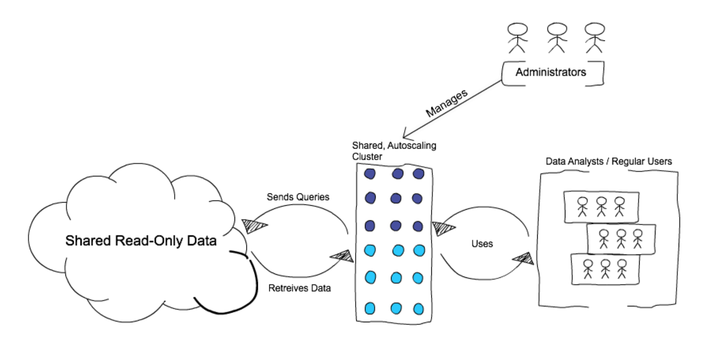
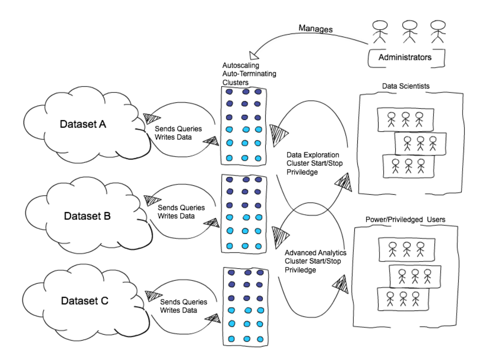
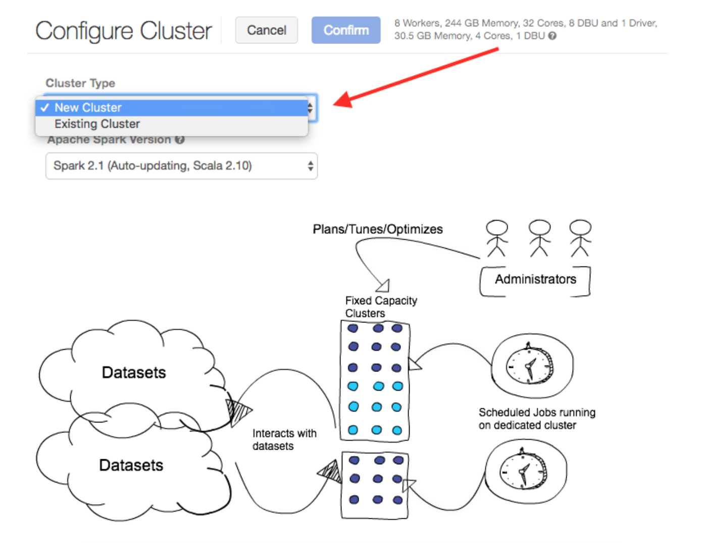

# Monitoring and Managing Azure DataBricks

Managing your Azure DataBricks instances includes a number of monitoring tasks, including the following:  

 - **Cluster Configuration Monitoring** - You will want to set up monitoring so that you gets alterts if cluster configuration drift occurs.  Azure DataBricks cluster instances include both standard and advanced configuation settings.  See  [cluster configuration](../configuration/clusters.md) for more detail.   If overall cluster workload requires you to increase cluster resources (DBUs), you'll want to consider re-configuration, including forecasting projected service costs. Review Azure Databricks DBU pricing by feature to best fit your workloads.  

 - **Cluster Job Monitoring** - You will want to monitor to be alterted on non-standard job executions. Non-standard job runs include failed jobs, long-running jobs and jobs which consume cluster resources above defined threshholds. See  [jobs-overview](../jobs/job-overview.md) for more detail

 ## Common Scenarios

The folowing common cluster configurations are provided for your refence in implementing and managing clusters and associated jobs:

 - Scenario 1: Generic usage across organization or larger groups (data analysts creating dashboards)
 - Scenario 2: Specialized use case or user groups within the organization (data scientists running explorations)
 - Scenario 3: Scheduled batch workloads (data engineers running ETL jobs)
 - Scenario 4: Cloning clusters (for administrators)

### Scenario 1: Generic usage across organization or larger groups (data analysts creating dashboards)
Suppose you need to provide a large group of users access to data for running ad-hoc queries (mostly SQL based). The cluster usage varies a lot between day to day and very few jobs are super intensive. The users mostly have read-only access to the data and most likely want to create dashboards from the different datasets through an easy and intuitive notebook interface.

  
The best approach for cluster provisioning under these circumstances is to use a hybrid approach for node provisioning in the cluster along with autoscaling. A hybrid approach involves defining the number of  instances to make up the cluster and then enabling autoscaling between the min and max number of instances.This cluster is always (24/7) on, shared by the users belonging to the group by default and scales up/down depending upon the load. The users do not have access to start/stop the cluster.

The initial instances are around to immediately respond to user queries for better usability. If the user query requires more capacity, autoscaling kicks in and provisions more nodes (or instances) to deal with the workload.

Databricks has other features to further improve this use case around multi-tenancy:

 - Handling Large Queries in Interactive Workflows - Automatically manages queries that will never finish.
 - Task Preemption for High Concurrency - Improves how long running jobs and shorter jobs work together.
 - Autoscaling local storage - Prevents running out of storage space(shuffle) in a multi-tenant environment.

This approach keeps the overall cost down by:
 - Using a shared cluster model.
 - Using a a flexible amount of instances (or DBUs).
 - Using autoscaling instead of a fixed-size cluster and avoid paying for underutilized cluster time.

### Scenario 2: Specialized use case or user groups within the organization (data scientists running explorations)
This scenario is for specialized use cases and groups within the organization. For example, data scientists running intensive exploration and machine learning algorithms requiring special libraries to be installed on the cluster, and so on.

  

A typical user will run some intensive data operations for a short period of time and then want to get rid of the cluster.

The best approach for this kind of workload is to have the Databricks admin create a cluster with pre-defined configuration (number of instances, type of instances, libraries to be installed, and so on) but allowing the users to start and stop the cluster using the Start Cluster feature. As an additional cost savings, the administrator can also enable the Auto Termination feature for these clusters based on some idle conditions (for example, a time based condition would be terminate the cluster if idle for more than an hour).  

This approach provides more control to users in terms of spinning up the clusters, but still provides the ability to keep the cost under control by pre-defining the configurations. For example, the administrator could decide to have a particular instance size for the cluster for data exploration use cases with auto termination enabled. This approach also allows the admin to configure different clusters for different groups of users with separate access permissions to different set of data using fine-grained permissions.

One downside to this approach is that users must involve the administrator for any changes to configuration, libraries, and so on, to the clusters.

### Scenario 3: Scheduled batch workloads (data engineers running ETL jobs)
This scenario involves running batch job JARs and notebooks on a regular cadence through the Databricks platform.

The suggested best practice is to launch a new cluster for each run of critical jobs. This helps avoid any issues (failures, missing SLA, and so on) due to an existing workload (noisy neighbor) on a shared cluster. Depending on the level of criticality for the job you could go full on-demand (to meet SLAs) or even balance between spot and on-demand instances (with Spot fall back to On-demand option enabled for the cluster) for some cost savings.

  

For non-critical example dashboard type jobs, you could use a shared cluster instead of provisioning a new cluster for each run.

### Scenario 4: Cloning clusters (for administrators)
The ability to clone clusters provides a convenient way for administrators to create a duplicate of an existing cluster retaining the same configurations, libraries, and so on. This allows the administrators to quickly provision identical clusters for each user or user group with similar configuration requirements. This feature provides a pseudo-templating capability and over time makes maintaining the configurations for different user and groups more convenient.

 
## Monitoring with Metrics
Metrics help you monitor the performance of Azure Databricks clusters.

You can install [Datadog agents](https://www.datadoghq.com/) on you cluster nodes to send Datadog metrics to your Datadog account. This topic includes notebooks that install Datadog agents on Databricks clusters.

### Datadog Metrics
  
This is a walk-through which shows you two ways to set up Datadog monitoring in Databricks:

 - **Automated Datadog Monitoring:** [Import Notebook](https://docs.databricks.com/_static/notebooks/datadog-init-script.html) A one-click way to automate Datadog monitoring for all of your Databricks nodes and clusters. With just one command, you can configure Databricks to start a Datadog agent and stream both system and Spark metrics to your Datadog dashboard every time you launch a cluster.
 - **Datadog Setup Walkthrough:** [Import Notebook](https://docs.databricks.com/_static/notebooks/initialize-data-dog-agent.html) A step-by-step process for installing the Datadog agent on an existing Databricks cluster to start collecting Spark-specific metrics. You can follow along and import the notebook if you want to test this integration on one of your own clusters.

### Automated Datadog Monitoring

    

If you’re looking for a way to set up monitoring for your Databricks’ clusters as quickly as possible, our [Datadog Init Scripts](https://docs.databricks.com/_static/notebooks/datadog-init-script.html) are a great option. When you import and run the first notebook above, it will create one init script that automatically installs a Datadog agent on every machine you spin up in Databricks, and one init script that configures each cluster to send Spark metrics. To use this script, all you need to do is:

- Enter your own Datadog API key in the DD_API_KEY parameter (Line 4).
- Run the notebook once to save the init script as a global configuration.  

After you run the notebook, each new cluster will begin streaming metrics directly to your dashboards in Datadog.

### What Exactly Is the init Script Doing?
The first script, `datadogInstall.sh`, simply creates an agent on every machine in your cluster according to the Datadog installation instructions (see Step 1 in the Datadog Setup Walkthrough section below).

The second script configures your cluster to report Spark-specific metrics back to Datadog. For more detail on this configuration, read the next section.

### Datadog Setup Walkthrough

Now let’s walk through the setup step by step. You can follow along in [this notebook](https://docs.databricks.com/user-guide/faq/datadog.html#initialize-data-dog-agent). This can be used to set up a Datadog agent on an existing cluster.

 - **One-line Install**. Datadog makes it very simple — a one-line curl command, to be exact — to install an agent on your system. In this case, we’ll use the Ubuntu package install:  

        %sh DD_API_KEY=[ENTER_YOUR_API_KEY_HERE] bash -c "$(curl -L https://raw.githubusercontent.com/DataDog/datadog-agent/master/cmd/agent/install_script.sh)"  

    You’ll find the latest version of this command in your [Datadog Setup Guide](https://app.datadoghq.com/account/settings#agent/ubuntu).

    Note: Make sure you check the Datadog site for the latest install command and use the API key specified in your account.

- **Configure for Spark**. In order to start monitoring the Spark metrics on a cluster, a Spark config file must be written into the driver of the cluster. This config file requires the hostname and port of the driver so that the Datadog agent can point to it and listen for the Spark metrics. The hostname and port can be found in the master-params file as follows:  

        %sh cat /tmp/master-params
        10.0.177.85 44752  

These gets entered into the spark_url parameter of the config as shown below:

        %s echo "init_config:
        instances:
        - resourcemanager_uri: http://10.0.177.85:44752
        spark_cluster_mode: spark_standalone_mode
        cluster_name: 10.0.177.85" > /etc/datadog-agent/conf.d/spark.yaml  

 - **Restart Agent**. Once this config file is updated, the agent simply needs to be restarted in order to complete the Spark integration.  

        %sh sudo service datadog-agent restart  

 - **Check Connection**. A successful connection can be confirmed by calling the Datadog info command and looking for the following Spark check:  
 
        %sh sudo datadog-agent status
        spark (5.12.1:1.0.0)
        --------------------
        - instance #0 [OK]
        - Collected 25 metrics, 0 events & 2 service checks

 Init scripts allow you to execute shell scripts on both the drivers and workers. In general, the init scripts from the article above can be adapted and customized to install and connect your monitoring agent of choice.

### Additonal Links

- [Azure Databricks Metrics](https://docs.azuredatabricks.net/user-guide/clusters/metrics.html)
- [Azure Databricks Pricing](https://databricks.com/product/azure-pricing)