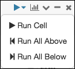
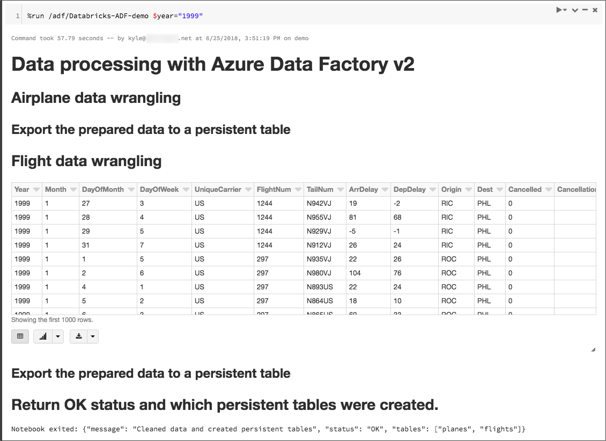
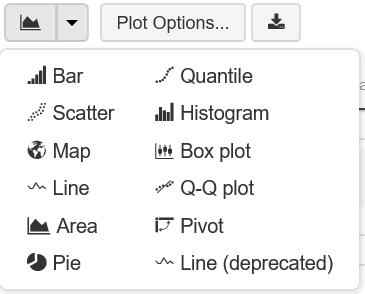
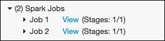
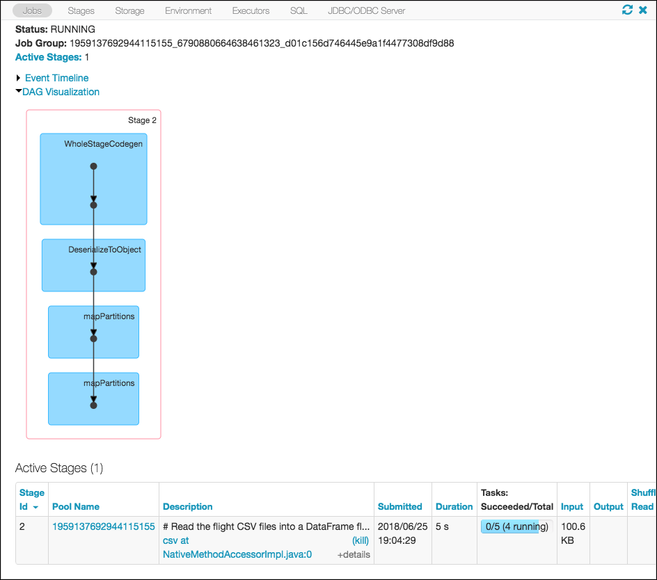
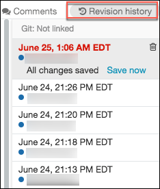
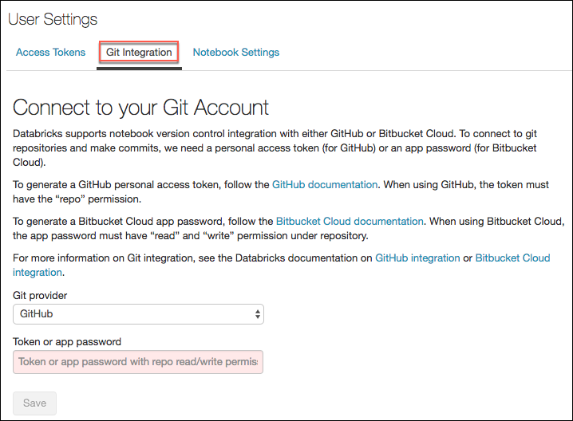

# Azure Databricks Notebooks

Azure Databricks notebooks are the primary interface for interacting with data and models in Azure Databricks, and where, as a developer, you will spend much of your time. Notebooks are made up of one or more of cells that allow for the execution of the code snippets or commands within those cells. They store commands and the results of running those commands. Notebooks are created with a default language, which can be Scala, Python, R, or SQL. A notebook needs to be attached to a cluster to execute commands, but is not tied to a cluster, so they can also be downloaded and shared.

> On a deeper level, in Azure Databricks, the notebook interface is the driver program for Apache Spark's master-worker architecture, orchestrating execution of work on the cluster.

Notebooks in Azure Databricks also provide a true collaborative environment for teams. They are multi-editable, providing a live and shared means for data engineers and scientists to engage in real-time collaboration. Dashboards and integration with Power BI enable business users to call an existing jobs, passing in parameters. Notebooks also allow users to enter comments on code within cells, so users can interact with each other, and collaborate on creating the notebook.

Azure Databricks supports several notebook formats:

- **Source**: A source file with an extension `.scala`, `.py`, `.sql`, or `.r`.
- **HTML**: An Azure Databricks proprietary notebook format with an `.html` extension.
- **DBC**: This is a  Databricks archive, which is a JAR file with extra metadata and has the extension .dbc. It is a package that lets you distribute collections of Azure Databricks HTML notebooks.
- **IPython Notebook**: An exported Jupyter notebook with the extension `.ipynb`.

## Cells

Cells are the building blocks of notebooks. They are executable blocks containing code written in one of several languages, which can be run independently of the other commands in the notebook. Cells within a notebook will use the notebook's default language.

### Execution

All cells in a notebook can be executed with the Run All button on the toolbar. If you do a Run All, all cells within the notebook are executed in a top-down fashion which should be intuitive. Individual cells can be executed through the UI by selecting the Run cell button within the cell, or by hitting `shift+enter` while the cell is selected.



While cells tend to be executed in a top-down order, it is possible to execute them out of  order, so caution should be used when hopping around from cell to cell and running cells separately, as this can result in unexpected or undesirable behavior. This is particularly relevant if multiple user are collaborating on the same notebook. For intance, the state of all variables are shared between collaborators of that notebook, so if one collaborator changes a variable without another using being aware, they may get results they did not expect.

As an example, if in a notebook where collaborator 1 sets the variable `x` to 5:

Cmd 8

```python
x = 5
```

Collaborator 2 working in the same notebooks adjusts that value to be 10 before collaborator 1 has a chance to run their next cell.

```python
x = 10
```

When collaborator 1 runs the following, they will get 20, not the value of 10 they would expect.

```python
y = x * 2
```

### Magic commands

Magic commands are special commands in Azure Databricks which can be used to specify the behavior of a cell within a notebook. Magic commands must appear on the first line of a cell, and are proceeded by `%`. If you are familiar with Juptyer notebooks on HDInsight, this is an important thing to note, as magic commands there start with `%%`.

#### %[language]

The `%[language name]` command is used to set the execution language for an individual cell in a notebook. This allows mixing of languages within a single notebook by overriding the default language of the notebook on a cell-by-cell basis. The language change only applies to the cell within which the `%[language]` magic command is entered, and does not change the overall language of the notebook. This is useful for many reason, including allowing developers to easily switch back and forth between language to simplify data wrangling, where it may be easier to write a simple SQL query, or perhaps execute a cell using Scala to get better performance for a particular command. The supported language magic commands are:

- `%python`
- `%r`
- `%scala`
- `%sql`

For example, to execute SQL code within a Python notebook you would add a cell with the following code:

```sql
%sql
SELECT f.UniqueCarrier, f.FlightNum, p.TailNum, p.AircraftType FROM flights f
INNER JOIN planes p on flights.TailNum = planes.TailNum
```

Specifying `%sql` on the first line tells the notebook to use SQL for executing the code within the cell.

#### %sh

You can use `%sh` to execute shell code in your notebook. This magic command includes the `-e` option in order to fail this cell (and subsequently a job or a run all command) if the shell command does not succeed. By default, `%sh` alone will not fail a job even if the `%sh` command does not completely succeed. Only `%sh -e` will fail if the shell command has a non-zero exit status.

#### %fs

The `%fs` magic command is shorthand for accessing `dbutils.fs`, which provides utilities for working with FileSystems. The `%fs` shorthand maps directly to `dbutils.fs` calls. For example, `%fs ls /databricks-datasets/asa/airlines/` translates into `dbutils.fs.ls("/databricks-datasets/asa/airlines/")`.

#### %md

Markdown can be included within your notebook, allowing you to add nicely formatted documentation and images directly in your notebook. To include documentation in a notebook you use the `%md` magic command to identify cells containing Markdown markup. Any Markdown markup included in a cell prefaced with the `%md` magic command will be rendered into HTML.

For example, this Markdown snippet:

```markdown
%md ## Azure Databricks Developer Guide
```

will be rendered as :

## Azure Databricks Developer Guide

#### %run

The `%run` magic command allow you to run a notebook from another notebook. This is a powerful command, which allows notebooks to serve a single purpose, and be chained together with other notebooks. The `%run` magic command is roughly equivalent to a Scala `:load` command or an `import` statement in Python.

> The `%run` command must be in a cell by itself as it runs the notebook inline.

For example, to run a notebook named Databricks-ADF-demo, with a parameter named year, in the shared adf folder, execute this command:

```python
%run /adf/Databricks-ADF-demo $year="1999"
```

This is equivalent to running the `dbutils.notebook.run` method.

```python
result = dbutils.notebook.run("/adf/Databricks-ADF-demo", 2400, {"accountName": accountName, "containerName": containerName})
```

Within the executing notebook, the notebook will execute inline, and the output of the notebook will be seen within the cell containing the `%run` command.

> Variables in the external notebook will be available to the calling notebook after execution of the `%run` command.



Parameters can be created through the use of widgets on the target notebook, and passed into the notebook using the syntax displayed above.

Used in conjunction with [Notebook Workflows](https://docs.azuredatabricks.net/user-guide/notebooks/notebook-workflows.html), you can easily build complex workflows and pipelines with dependencies between multiple notebooks. Notebook Workflows support if/then/else workflows based on return values, which cannot be accomplished with the `%run` command alone.

Return values can be set up by adding a cell in the target notebook, as follows:

```python
import json
dbutils.notebook.exit(json.dumps({
  "status": "OK",
  "message": "Cleaned data and created persistent tables",
  "tables": ["planes", "flights"]
}))
```

To view the return value, you issue a command similar to the following in the calling notebook:

```python
import json
print(json.loads(result))
```

### Visualizations

Cells returning tabular data support a number of visualizations out of the box. All notebooks, regardless of their language, support Databricks visualization using the `display` function. The display function includes support for visualizing multiple data types. As opposed to the handful of basic visualizations that other notebook engines provide, Azure Databricks includes several out of the box that you traditionally would need to rely on an external library such as `matplotlib` to obtain. However, if you wish to use external libraries to augment the default ones, you are free to do so. You can learn more about using visualizations the [Business Intelligence and Visualization](../business-intelligence-datavis/bi-and-datavis.md) article.



### Package Cells

Package cells are special cells that get compiled when executed. These cells have no visibility with respect to the rest of the notebook, and they are essentially considered as separate Scala files. If you wish to use custom classes and/or objects defined within notebooks reliably in Spark, and across notebook sessions, you must use package cells to define those classes.

To learn more, look at [Packaged Cells in Notebooks](https://docs.azuredatabricks.net/user-guide/notebooks/package-cells.html).

## Directed Acyclic Graphs (DAGs)

Apache Spark builds optimized execution plans for the commands contained within cells. Directed Acyclic Graphs (DAGs) provided visualizations of that plan. While generating the series of steps, Spark will optimize lots of things along the way, and will even generate code to do so. Under the hood, Apache Spark will execute either transformations or actions. Transformations are lazily processed, and do not get completed at the time of cell execution. They only get executed when you call an associated action on the data. This process is done to allow Spark to optimize the query, based on everything it is being asked to perform. In a notebook, you can view DAGs by expanding Spark Jobs under a cell which performs an action, and selecting View next to a Job.



In the Jobs view, you can view the DAG created by Spark for execution, view the Stages, Storage, and other environmental settings for the job.



DAGs can be useful for understanding how Apache Spark is interpreting your commands, and building an optimized query, and are a good place to inspect if you run into performance issues with any particular query or command.

## Variables

Once a notebook is run, the variables will be declared in the order in which they are invoked. They live until either the notebook is detached from the cluster or the cluster is terminated/restarted.

### Predefined variables

Each notebook includes predefined variables for accessing the Spark Session, and built-in libraries.

- `SparkSession` is made available via the `spark` variable. This is the core location for where Apache Spark related information is stored.
- `sparkContext` made available as `sc`
- `sqlContext`

In Spark 2.x applications, you will use the `spark` variable as the access point for Spark and SparkSQL.

## Version control

Changes to Azure Databricks notebooks are maintained in a Revision history. This can be helpful in reverting to a previous version of a notebook, or identifying code changes between versions of a notebook. You can select any previous version to view the notebook at that point, and restore to that version, if desired. You can also save a revision with comments, by selecting the **Save now** link on the most recent revision, and entering comments in the Save Notebook Revision dialog.



### Git integration

Databricks also supports version control integration with either GitHub or Bitbucket Cloud. To connect to your account, select User Settings from the Account icon menu, and select Git Integration. More info can be found at [GitHub Version Control](https://docs.azuredatabricks.net/user-guide/notebooks/github-version-control.html) and [Bitbucket Cloud Version Control](https://docs.azuredatabricks.net/user-guide/notebooks/bitbucket-cloud-version-control.html)



## Widgets

Parameterization of notebooks is handled through the use of input widgets. Within a notebook, you can create, remove and get bound widget values using the widget API, `dbutils.widgets`. The widget API consists of calls to create different types of input widgets, remove them, and get bound values.

Widgets are best for building notebooks or dashboards that are re-executed with different parameters, such as quickly exploring results of a single query with different parameters.

To learn more, visit the [widgets documentation](https://docs.azuredatabricks.net/user-guide/notebooks/widgets.html).

## Security

With the Premium tier of Azure Databricks, notebooks can be secured using Azure Active Directory and Role-based access controls (RBAC), which allows teams to more tightly control what actions can be performed by users. As an example, a developer my have permissions to create and edit notebooks, while a business user may only be able to run notebooks. This topic is covered in greater detail in the [User Management](../user-management/user-management.md) article of this guide.

## Next steps

Read next: [Business intelligence and data visualization](../business-intelligence-datavis/bi-and-datavis.md)