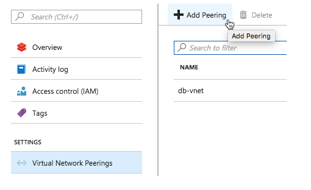
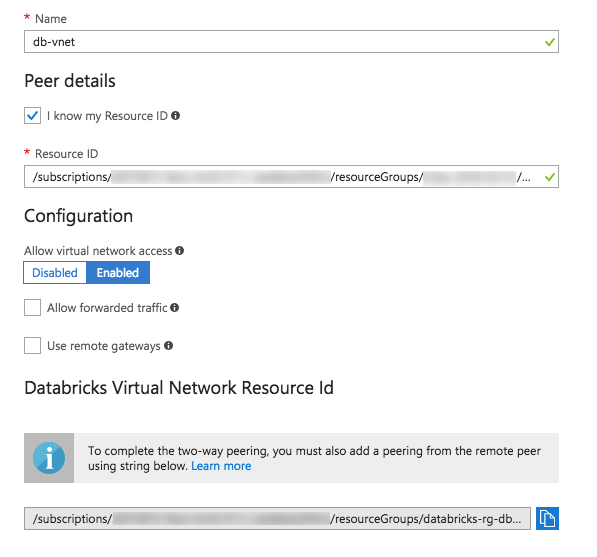
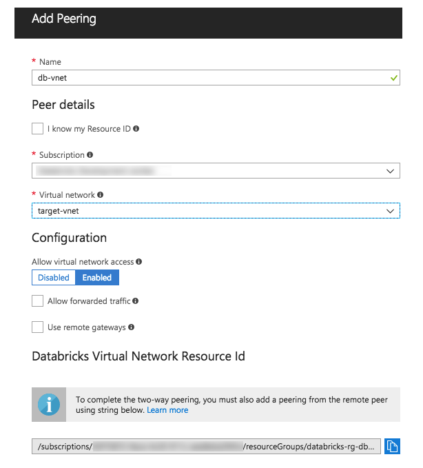
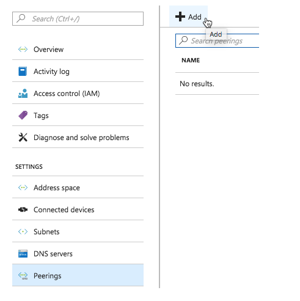
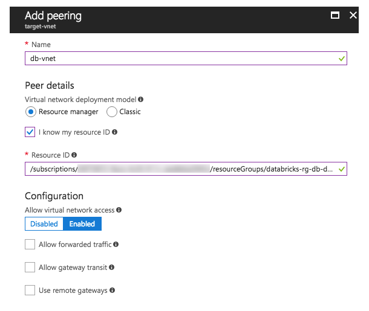
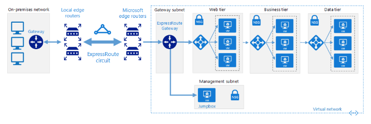
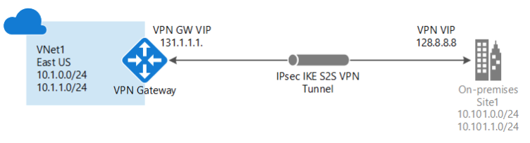

# Azure Databricks Security and Networking

When planning and implementing your Azure Databricks deployments, you have a number of considerations about networking and network security implementation details.  In this article you will be introduced to number of typical topics in this area.

## Virtual Network Peering

Virtual network (VNet) peering allows the virtual network in which your Azure Databricks resource is running to peer with another Azure virtual network. Traffic between virtual machines in the peered virtual networks is routed through the Microsoft backbone infrastructure, much like traffic is routed between virtual machines in the same virtual network, through private IP addresses only.  

For an overview of Azure VNet peering, see [Microsoft Azure Virtual network peering](https://docs.microsoft.com/en-us/azure/virtual-network/virtual-network-peering-overview).

This article shows you how to peer an Azure Databricks VNet with an Azure VNet and provides references to information about how to connect an on-premise VNet to an Azure VNet.
For information about how to manage Azure VNet peering, see [Create, change, or delete a virtual network peering](https://docs.microsoft.com/en-us/azure/virtual-network/virtual-network-manage-peering). IMPORTANT: Do not follow the steps in that topic to create a VNet peering between an Azure Databricks VNet and an Azure VNet; follow the instructions below.

### Peering a Databricks virtual network to an Azure VNet

Peering a Databricks virtual network to an Azure VNet involves two steps:

 - Step 1: Add remote virtual network peering to Databricks virtual network
 - Step 2: Add Databricks virtual network peer to remote virtual network  

#### Step 1: Add remote virtual network peering to Databricks virtual network
 - In the Azure Portal, click an Azure Databricks Service resource.
 - In the Settings section of the sidebar, click the Virtual Network Peering tab.
 - Click the + Add Peering button.  
   
 - In the Name field, enter the name for the peering virtual network.
 - Depending on the information you have about the remote virtual network, do one of the following:
    - You know the resource ID of the remote virtual network:
        - Select the I know my Resource ID checkbox.
        - In the Resource ID text box, paste in the remote virtual network resource ID.
         

    - You know the name of the remote virtual network:
        - In the Subscription drop-down, select a subscription.
        - In the Virtual network drop-down, select the remote virtual network.
        

 - In the Configuration section, specify the configuration of the peering. See Create a peering for information about the configuration fields.
- In the Databricks Virtual Network Resource Id section, copy the resource ID.
- Click Add. The virtual network peering is deployed.

#### Step 2: Add Databricks virtual network peer to remote virtual network
 - In the Azure Portal sidebar, click Virtual networks.
 - Search for the virtual network resource to peer with the Databricks virtual network and click the resource name.
 - In the Settings section of the sidebar, click the Peerings tab.
 - Click the + Add button.  
 
 - In the Name field, enter a name for the peering virtual network.
 - For the peering details, Virtual network deployment model must be Resource manager.
 - Select the I know my resource ID checkbox.
 - In the Resource ID text box, paste in the Databricks virtual network resource ID copied in Step 1.
 
 - In the Configuration section, specify the configuration of the peering. See Create a peering for information about the configuration fields.
 - Click OK. The virtual network peering is deployed.

Connect an on-premises virtual network to an Azure virtual network
To connect an on-premises network to an Azure VNet, follow the steps in Connect an on-premises network to Azure using ExpressRoute.

To create a site-to-site VPN gateway connection from your on-premises network to an Azure VNet, follow the steps in Create a Site-to-Site connection in the Azure portal.

### Express Route

The reference architecture shown below shows how to connect an on-premises network to virtual networks on Azure, using Azure ExpressRoute. ExpressRoute connections use a private, dedicated connection through a third-party connectivity provider. The private connection extends your on-premises network into Azure. Deploy this solution.

####  Architecture
The architecture consists of the following components.

 - On-premises corporate network. A private local-area network running within an organization.

- ExpressRoute circuit. A layer 2 or layer 3 circuit supplied by the connectivity provider that joins the on-premises network with Azure through the edge routers. The circuit uses the hardware infrastructure managed by the connectivity provider.

 - Local edge routers. Routers that connect the on-premises network to the circuit managed by the provider. Depending on how your connection is provisioned, you may need to provide the public IP addresses used by the routers.

 - Microsoft edge routers. Two routers in an active-active highly available configuration. These routers enable a connectivity provider to connect their circuits directly to their datacenter. Depending on how your connection is provisioned, you may need to provide the public IP addresses used by the routers.

 - Azure virtual networks (VNets). Each VNet resides in a single Azure region, and can host multiple application tiers. Application tiers can be segmented using subnets in each VNet.

 - Azure public services. Azure services that can be used within a hybrid application. These services are also available over the Internet, but accessing them using an ExpressRoute circuit provides low latency and more predictable performance, because traffic does not go through the Internet. Connections are performed using public peering, with addresses that are either owned by your organization or supplied by your connectivity provider.

 - Office 365 services. The publicly available Office 365 applications and services provided by Microsoft. Connections are performed using Microsoft peering, with addresses that are either owned by your organization or supplied by your connectivity provider. You can also connect directly to Microsoft CRM Online through Microsoft peering.

 - Connectivity providers (not shown). Companies that provide a connection either using layer 2 or layer 3 connectivity between your datacenter and an Azure datacenter.

See complete scenario implementation steps at this [link](https://docs.microsoft.com/en-us/azure/architecture/reference-architectures/hybrid-networking/expressroute)
### Create a Site-to-Site connection in the Azure Portal

This section highlights for you the steps involved in using the Azure portal to create a Site-to-Site VPN gateway connection from your on-premises network to the VNet. The steps in this article apply to the Resource Manager deployment model. You can also create this configuration using a different deployment tool or deployment model by selecting a different option from the following list:

A Site-to-Site VPN gateway connection is used to connect your on-premises network to an Azure virtual network over an IPsec/IKE (IKEv1 or IKEv2) VPN tunnel. This type of connection requires a VPN device located on-premises that has an externally facing public IP address assigned to it. For more information about VPN gateways, see [About VPN gateway](https://docs.microsoft.com/en-us/azure/vpn-gateway/vpn-gateway-about-vpngateways).

0. Before you begin
1. Create a virtual network
2. Specify a DNS server
3. Create the gateway subnet
4. Create the VPN gateway
5. Create the local network gateway
6. Configure your VPN device
7. Create the VPN connection
8. Verify and Update the VPN connection
    - To connect to a virtual machine
    - How to reset a VPN gateway
    - How to change a gateway SKU (resize a gateway)
    - How to add an additional connection to a VPN gateway

There are a number of common steps in implementing this process.  They are shown above.  Here is a link to implementation detail for [all steps in this process](https://docs.microsoft.com/en-us/azure/vpn-gateway/vpn-gateway-howto-site-to-site-resource-manager-portal).

### Other Information

Q:Can I use my own keys for local encryption?  
A:In the current release, using your own keys from Azure Key Vault is not supported.

Q:Can I use Azure virtual networks with Databricks?
A:A new virtual network is created as part of Databricks provisioning. In this release, you cannot use your own Azure virtual network.

Q:How do I access Azure Data Lake Store from a notebook?
A: In Azure Active Directory (Azure AD), provision a service principal, and record its key.
Assign the necessary permissions to the service principal in Data Lake Store.
To access a file in Data Lake Store, use the service principal credentials in Notebook.

## More Information
 - Connect [on-premises network to Azure using Express Route](https://docs.microsoft.com/en-us/azure/architecture/reference-architectures/hybrid-networking/expressroute)
 - Connect via [a Site-to-Site connection](https://docs.microsoft.com/en-us/azure/vpn-gateway/vpn-gateway-howto-site-to-site-resource-manager-portal)
 - List of Azure Databricks [regions](https://docs.azuredatabricks.net/administration-guide/cloud-configurations/regions.html)
 - For More: [Common Questions](https://docs.microsoft.com/en-us/azure/azure-databricks/frequently-asked-questions-databricks)
 - How to [connect using the Azure cloud shell](https://docs.microsoft.com/en-us/azure/azure-databricks/databricks-cli-from-azure-cloud-shell)
 - How to [connect to data sources](https://docs.microsoft.com/en-us/azure/azure-databricks/databricks-connect-to-data-sources)
 - How to [connect to Excel, R or Python](https://docs.microsoft.com/en-us/azure/azure-databricks/connect-databricks-excel-python-r)

