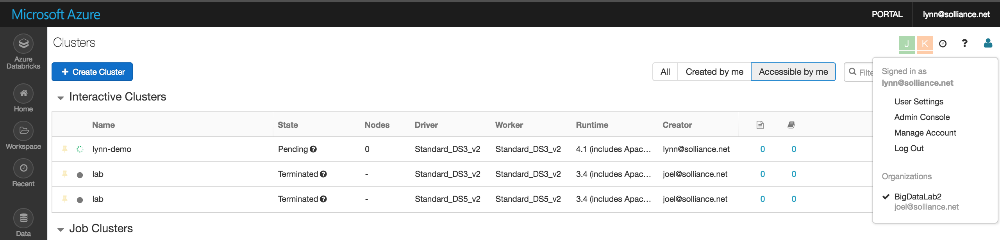
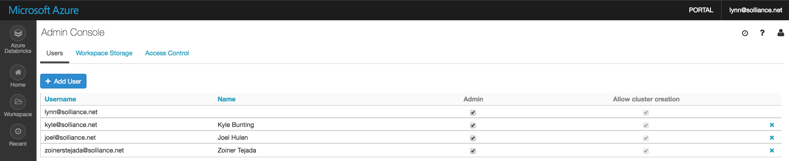

# Manage Azure Databricks Users

The premium pricing tier of Azure Databricks includes fine-grained permission management.  When you deploy an instance here, then you can plan and implement access control of your deployment objects.  Implement control by configuring object-level access permissions for users and roles.  You can implement control over workspace storage and other objects, such as cluster actions, tables, etc...

## Understanding User Roles

Users are grouped as follows: regular users and administrative users.  In Azure Databricks, there are three types of administrators: account owner, account admins, and cloud configuration admins.

1. **Account Owner** - The account owner can view and make changes to your Azure Databricks service and Azure subscription. This user is typically the person who signed up for or created your Azure Databricks service. If you don’t know who your account owner is, contact Azure Databricks support.  To see step-by-step instructions on how to manage an Azure Databricks account, including deleting an Azure Databricks service or cancelling an Azure subscription, see this [link](https://docs.azuredatabricks.net/administration-guide/account-settings/account.html)  
2. **Account Admins** - Account admins can manage users, workspace storage, and access control for your Azure Databricks instance. Admins can delegate admin privileges to other users.  

3. **Cloud Configuration Admins** - Cloud configuration admins manage networking for your Azure Databricks instance.

## Manage Users with Admin Console

The Azure Databricks Admin Console is the central location for administrators to manage users, workspace storage, and access control for their Azure Databricks instance.  To access the Admin Console click the Account user account icon at the top right of the product and then click on the 'Admin Console' link to open the Admin Console.  Note: Users who are members of the 'Administrator users group' have permission to manage user accounts on the Admin Console page.

   

Administrator users can perform the following user actions using the Admin Console:
- can Add and Remove Users
- can Grant and Revoke permission to create clusters (subject to cluster access control configuration)
- can Grant and Revoke administrator rights by selecting the Admin checkbox.

### To Add a user

 - Go to the Admin Console.
 - Click Add User.
 - Provide the user email ID.

You can add any user who belongs to the Azure Active Directory tenant of your Azure Databricks workspace.

   
NOTE: If cluster access control is enabled, the user is added without cluster creation permission.

### To Remove a user

 - Go to the Admin Console.
 - Click the Remove User Icon (x) at the far right of the user row.
 - Click Remove User to confirm.

## Single Sign-On
Single sign-on (SSO) in the form of Azure Active Directory-backed login is available in Azure Databricks for all customers. Here's a [link](https://docs.microsoft.com/en-us/azure/active-directory/connect/active-directory-aadconnect-sso)

## Guest Users

Users can now sign in to Azure Databricks only if they belong to the Azure Active Directory (Azure AD) tenant of the Azure Databricks workspace. If you have users who do not belong to the Azure AD tenant, you can add them as standard or [guest users](https://docs.microsoft.com/en-us/azure/active-directory/fundamentals/add-users-azure-active-directory).

## Next Steps

Read next: [Manage Azure DataBricks Access Control](../workspace/2_manage-access.md)

